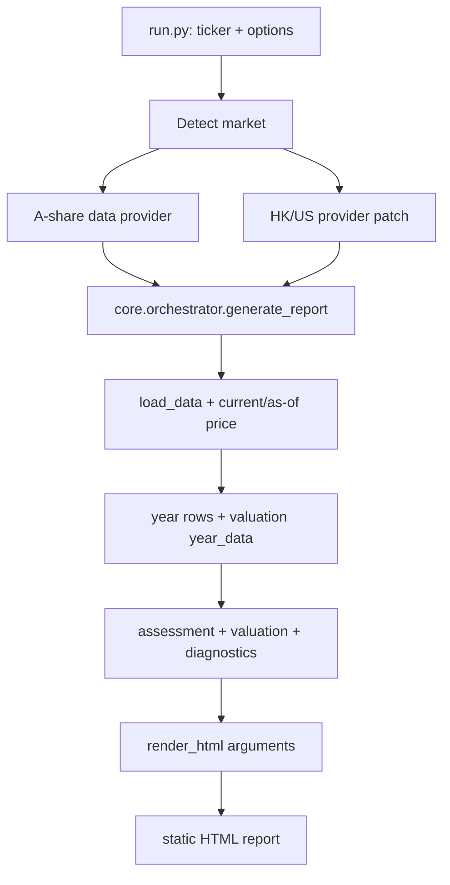
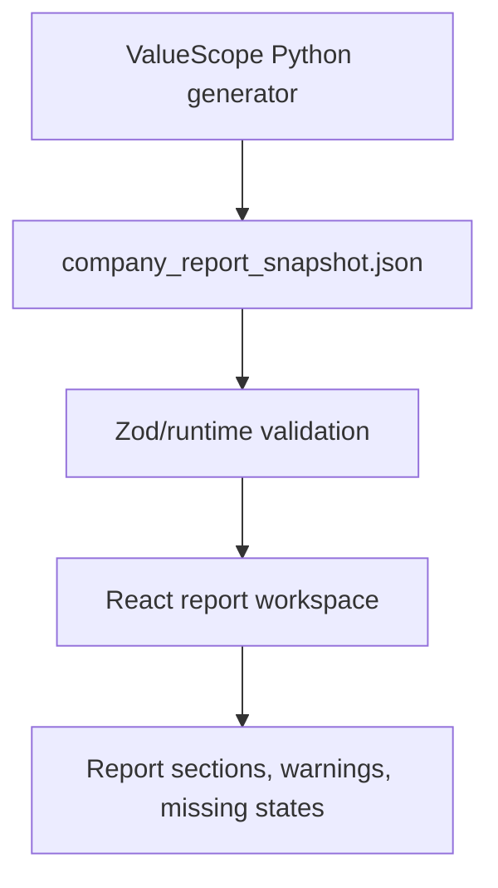

# stock-scripts Capability Map

Date: 2026-05-05

## Purpose

This document maps the reference project `/Users/dingyitian/Desktop/stock-scripts` into ValueScope-owned work. ValueScope should reproduce the financial report capability, data contracts, and metric language, but must not import, wrap, or depend on `stock-scripts` internals.

## Reading Scope

Reviewed:

- Entry points: `run.py`, `Makefile`, `batch_generate_reports.py`
- Report pipeline: `core/orchestrator.py`, `core/render.py`
- Data providers: `core/data_a.py`, `core/data_hk_us.py`, `core/cache.py`
- Metric logic: `core/valuation.py`, `core/assessment.py`, `core/technicals.py`, `core/utils.py`, `core/config.py`
- Screening scripts: `stock_screen.py`, `initial_screen.py`, `secondary_screen.py`, `tertiary_screen.py`, `oe_screen.py`, `retention_screen.py`, `roic_screen_go/main.go`
- Docs: `README.md`, `INDICATOR_GUIDE.md`, `docs/ARCHITECTURE.md`, `docs/BANK_WORKFLOW.md`, `docs/HK_US_QUIRKS.md`, `docs/OWNER_EARNINGS_EXPLAINED.md`
- Tests: `tests/test_historical_share_basis.py`

## Reference Runtime Flow

ValueScope should preserve the same conceptual boundary, but replace the final static HTML output with:

## High-Priority Report Capabilities

| Capability | Reference Files | ValueScope Reproduction | Snapshot Contract | React Surface | Story |
|---|---|---|---|---|---|
| CLI single-stock report generation | `run.py`, `core/orchestrator.py` | Own `generate-company-report` command that emits JSON | `source`, `company`, `coverage`, `sections`, `warnings` | Load generated/committed report | US-003 |
| Market and ticker identity | `run.py`, `core/data_hk_us.py` | Normalize ticker and keep market explicit without hard-coding A shares into architecture | `company.market`, `company.ticker`, `company.currency`, `company.accounting_unit` | Header metadata | US-003, later HK/US |
| Data acquisition and cache boundary | `core/data_a.py`, `core/cache.py` | ValueScope-owned provider layer; cache may exist but no DB | `source.provider`, `source.cache`, `source.freshness` | Source/freshness badges | US-007 |
| Annual financial rows | `core/orchestrator.py:build_year_rows` | Build yearly rows for report sections from normalized financial inputs | Section tables with per-cell status | Tables for profitability, cash cycle, capital efficiency | US-012 |
| Metric definitions and ratings | `INDICATOR_GUIDE.md`, `core/assessment.py` | Encode metric formula, direction, unit, thresholds, tone | `metric_definitions`, metric `status`, `tone`, `basis` | Metric cards with formula and meaning | US-013 |
| Valuation overview | `core/valuation.py`, `core/render.py` | Reproduce OE-DCF, Munger PE, PEG/PEGY, earnings yield, market PE anchor | `sections.valuation`, `valuation_details`, scenario matrix | Valuation cards and annual anchor table | US-014 |
| Owner earnings three-caliber model | `core/valuation.py`, `docs/OWNER_EARNINGS_EXPLAINED.md` | Compute conservative/base/lenient OE and OE yield history | OE values with formula basis and warning status | OE table and explanation | US-015 |
| Business quality / pricing power summary | `core/assessment.py` | Reproduce gross margin, purity, DSO/DPO/CCC, ROIIC, Capex/NI | `sections.quality`, `sections.cash_cycle`, `sections.capital_efficiency` | Quality radar-style sections | US-016 |
| Financial safety | `core/assessment.py` | Reproduce ROA, ROE, ROIC, ROE-ROIC, interest coverage, net cash, debt, goodwill | `sections.financial_safety` | Financial quality cards and tables | US-017 |
| Cash flow quality | `core/assessment.py`, `core/data_a.py` | Reproduce OCF/NI, real EPS, OCF per share, Capex and D&A treatment | `sections.cash_flow` | Cash flow and EPS quality sections | US-018 |
| Shareholder returns | `core/assessment.py` | Reproduce dividends, payout, buyback, equity financing, total shareholder yield | `sections.shareholder_returns` | Dividend/buyback/TSY table | US-019 |
| Share capital diagnostics | `core/assessment.py`, `tests/test_historical_share_basis.py` | Preserve valuation/as-of/reported share basis and fallback confidence | `sections.share_capital`, `diagnostics.share_basis` | Share basis confidence section | US-020 |
| Data quality report | `core/assessment.py:build_data_quality_report` | Explain missing, not applicable, warning, and confidence states | top-level `warnings`, section `warnings`, `data_quality` | Warnings near affected sections | US-021 |
| Bank-specific report branch | `docs/BANK_WORKFLOW.md`, `core/assessment.py`, `core/valuation.py` | Reproduce bank metrics separately from industrial companies | bank sections and bank valuation details | Bank profitability, credit, franchise, stress test | US-022 |
| Technical and market environment modules | `core/technicals.py` | Reproduce Williams %R and market environment as optional modules | optional `sections.technical`, `sections.market_environment` | Optional chart/summary modules | US-023 |
| As-of backtest mode | `core/backtest.py`, `core/data_a.py` | Reproduce historical report generation and future return comparison later | `source.mode=as_of`, `as_of_date`, share basis mode | Backtest report view | US-024 |

## Screening Capabilities For Later

These are not Sprint 001 work. They should start only after report JSON generation and report UI are trustworthy.

| Capability | Reference Files | Later ValueScope Direction |
|---|---|---|
| Preset screener | `stock_screen.py` | User-editable client-side recipe over `screen_snapshot.json` |
| Initial broad screen | `initial_screen.py` | Universe snapshot with PE, market cap, float ratio, ST exclusion |
| Secondary holder/OCF screen | `secondary_screen.py` | Explainable pass/fail rows with holder concentration and OCF rules |
| Tertiary deep quality screen | `tertiary_screen.py` | Report-grade metrics reused by screener conditions |
| OE yield screen | `oe_screen.py` | Batch precision pass using report valuation functions |
| Dollar retention screen | `retention_screen.py` | Candidate ranking from retention test evidence |
| Go ROIC scanner | `roic_screen_go/main.go` | Optional performance reference, not an MVP architecture constraint |

## Suggested Epics

### E1 Report Snapshot Foundation

Goal: create the JSON boundary that replaces static HTML as the handoff from Python to UI.

Includes US-002, US-003, US-012, US-021.

### E2 React Report Parity

Goal: render the old report sections in React with better structure and explicit missing states.

Includes US-004, US-005, US-013 through US-020.

### E3 Full Report Reproduction

Goal: cover all major non-bank A-share report sections from `stock-scripts`.

Includes valuation, OE, pricing power, cash flow, shareholder return, share capital, data quality, and technical/market modules.

### E4 Bank and Multi-Market Report Support

Goal: reproduce bank-specific branch and later HK/US quirks without making A shares permanent.

Includes US-022 and later HK/US provider stories.

### E5 Explainable Screener

Goal: build stock screening after report metrics are trustworthy.

Includes US-006 and current later backlog screening stories.

## Sprint 001 Parity Slice

Sprint 001 should prove the JSON-to-React report path with a small sample. The smallest useful slice is:

- One single-stock report snapshot command.
- Metadata: schema version, generated time, ticker, company name, market, currency, provider, coverage years.
- Year rows for a small committed sample.
- Core sections:
  - valuation overview
  - quality summary
  - cash flow quality
  - capital safety
  - shareholder returns
  - metric explanations
  - warnings/data quality
- Status model: `ok`, `missing`, `not_applicable`, `warning`, `error`.
- UI validation with invalid snapshot and missing-value sample.

## Deferred Review Questions

These should go into `/plan-ceo-review` and `/plan-eng-review` after this audit, not block the documentation work:

- How strict must Sprint 001 be on exact visual parity versus improved React report structure?
- Which sample company is acceptable for committed JSON without bloating the repo?
- Should the generator first support only A shares, or should its schema include HK/US fields from day one?
- Which computations should be exact parity first, and which can be marked as planned with clear warnings?
- How much historical/as-of support is required before screening starts?

## Important Reproduction Rules

- `stock-scripts` is evidence and language, not a runtime dependency.
- Missing financial values are missing, not zero.
- Not applicable, insufficient history, formula invalid, and provider failure must remain distinguishable.
- Valuation share basis is a high-risk contract and needs regression tests.
- Bank metrics are a separate branch, not a pile of exceptions inside industrial-company formulas.
- Screening should reuse report-grade metrics instead of inventing a parallel metric vocabulary.
